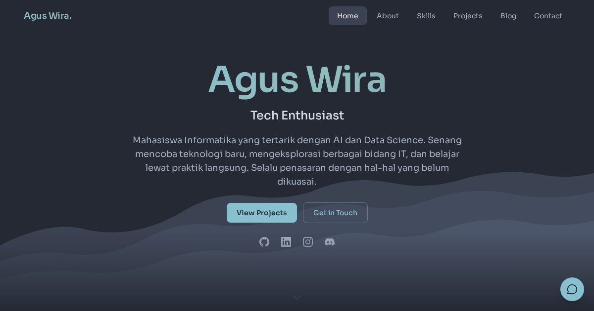

# Agus Wira — Portfolio

Portfolio pribadi Agus Wira—tempat untuk memperkenalkan diri, mendokumentasikan proyek, dan membagikan perjalanan belajar di bidang teknologi.

[Kunjungi aguswira.dev](https://aguswira.dev)

## Tentang portfolio ini

Website ini menyatukan profil, project case study, tulisan, contact form, dan asisten interaktif dalam satu pengalaman yang ringan dan responsif. Setiap halaman dirancang untuk membantu pengunjung memahami proses, keputusan teknis, serta hasil dari karya yang ditampilkan.

## Highlights

- Project case study dan tulisan berbasis konten terstruktur.
- Navigasi chapter dengan pinned scrolling dan motion yang tetap aksesibel.
- Kartu proyek image-first dengan status dan ringkasan yang jelas.
- Contact form dengan proteksi rate limit dan fallback tanpa JavaScript.
- Asisten interaktif dengan respons streaming.
- SEO, social metadata, structured data, dan security headers yang siap produksi.
- Pengujian otomatis untuk fungsi, aksesibilitas, tampilan, dan performa.

## Dibangun dengan

Astro, TypeScript, Tailwind CSS, GSAP, MDX, Upstash Redis, Resend, dan Vercel.

---

© Agus Wira — [aguswira.dev](https://aguswira.dev)
